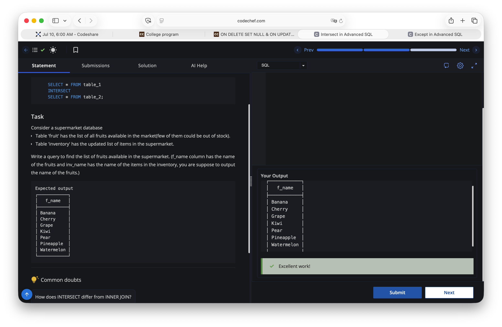

# Experiment 2.3

## Aim
To execute the given SQL query.

## Question
Refer to the SQL query below.

## Query
```sql
SELECT f_name FROM fruit
INTERSECT
SELECT inv_name FROM inventory;
```

## Output


