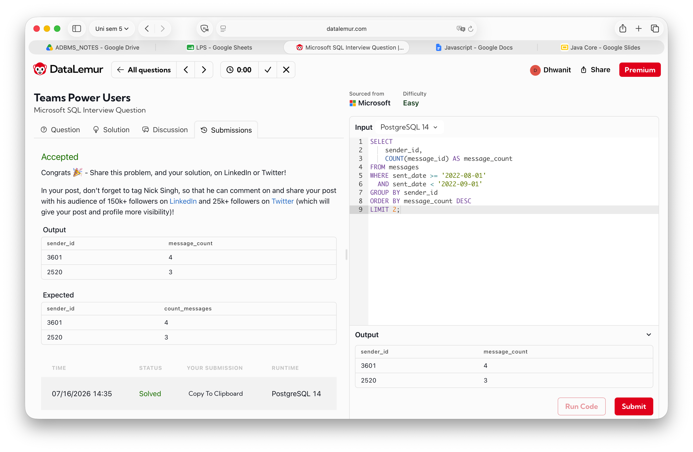

# Ques 2

## Aim
To count grouped records.

## Question
Display the top senders by message count for August 2022.

## Query
```sql
SELECT
    sender_id,
    COUNT(message_id) AS message_count
FROM messages
WHERE sent_date >= '2022-08-01'
  AND sent_date < '2022-09-01'
GROUP BY sender_id
ORDER BY message_count DESC
LIMIT 2;
```

## Output


